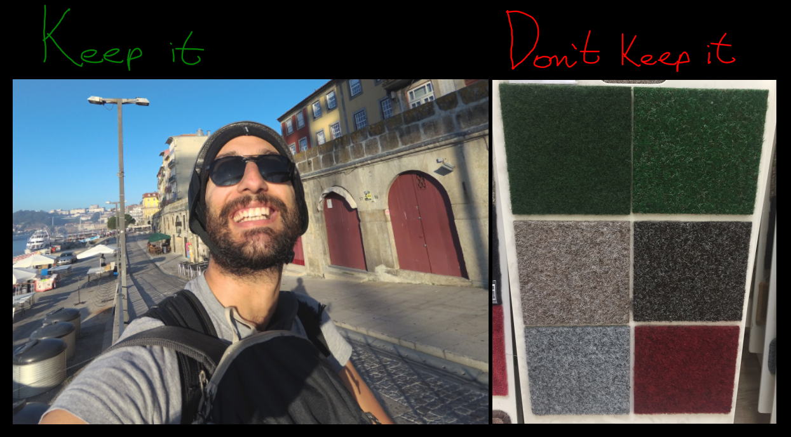

# Overview
In this repository I implemented a simple classifier using keras to classify
photos from a photo into "Keep it" "Don't Keep it" to automate the process
of going through your photo album and selecting the photos you want to keep.
We will train a binary classifier to classify images into "keep it" versus
"don't keep it":


If you want you can check out my medium article about it: https://medium.com/@lucas-soares/building-a-classifier-to-filter-out-unused-images-from-your-photo-album-6bc574ae57de

# Set up

```pip install -r requirements.txt```

---
# Creating the dataset
Sorting your files and moving them to this folder: `files_with_dates`

```python sort_creation_time.py --path ./path/to/your/images/folder```
### Creating the train/test folders
```python create_dataset.py```
### Splitting files into train and test folder (80%/20%)
```python create_train_test.py```

---
# Training the classifier
We train 2 types of classifiers, first a simple keras implementation of a 
classic CNN borrowed from this [blog post by François Chollet](https://blog.keras.io/building-powerful-image-classification-models-using-very-little-data.html).

```python train.py --epochs 10 --batch_size 16```

Be careful with the size of your images, in this implementation
we resize all images to 150x150.

We also train a pre-trained inception v3 model using template code taken from
[here](https://keras.io/api/applications/). 

```python train_pretrained.py --epochs 10 --batch_size 16```

# Running the app
Now, to run the app to see your classifier in action you can run:

```streamlit run app.py```

You can load an image with streamlit's file uploader and the classification will
be written below.

---

# Credits
- For the basic cnn model: https://blog.keras.io/building-powerful-image-classification-models-using-very-little-data.html
- For the code to fine tune the inception model: https://keras.io/api/applications/


